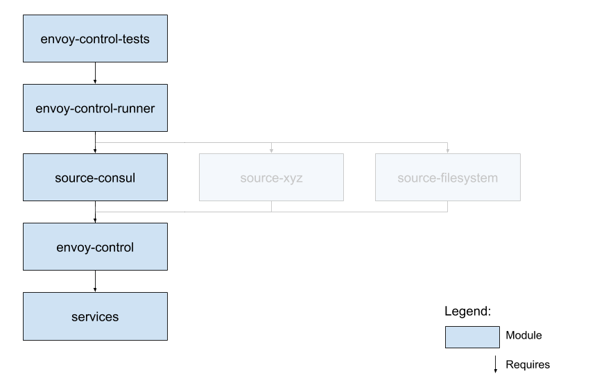

# Architecture

## High level

This is high level view of Service Mesh system with Envoy Control

In each cluster, Envoy Control polls the services' location from a discovery service system. Then, the state
is propagated to Envoy instances running alongside service instances.

When _service-a_ wants to communicate with _service-b_ it sends a request to it, but the request is intercepted
by Envoy, which will redirect the request to proper instance. Envoy can also add tracing headers, add encryption,
circuit breaking and much more.

## Envoy control

Envoy Control is responsible for feeding Envoys with configuration of 
[CDS](https://www.envoyproxy.io/docs/envoy/latest/intro/arch_overview/operations/dynamic_configuration#cds),
[EDS](https://www.envoyproxy.io/docs/envoy/latest/intro/arch_overview/operations/dynamic_configuration#eds),
[RDS](https://www.envoyproxy.io/docs/envoy/latest/intro/arch_overview/operations/dynamic_configuration#rds),
and [LDS](https://www.envoyproxy.io/docs/envoy/latest/intro/arch_overview/operations/dynamic_configuration#lds)
data based on custom metadata.
Right now CDS, and EDS data comes from Consul service discovery,
but there is nothing special about our integration with Consul and users can integrate as many sources as they want.

## Sources

Source is a stream of `ClusterState`s. The `ClusterState` is a current representation of `services` and `service instances`
(which map to `cluster` and `endpoint` from Envoy's terminology). 

There can be many sources, all they have to do is:

* implement `LocalClusterStateChanges`
* be exposed as a bean - if you're using Envoy Control Runner then all of them will be combined in
`GlobalStateChanges`, if not - you have to combine them yourself

### Consul
Implements a stream of service instance changes coming from Consul discovery service.

## Modules

### Envoy Control
The core module that provides integration with Envoy and API to integrate Discovery Service system.

### Envoy Control Runner
Example of code that builds Control Plane and runs it. It uses [Spring Framework](https://spring.io/) to connect
elements and serve HTTP endpoint and HTTP client for [Cross DC Synchronization](features/multi_dc_support.md) feature.

#### Why Spring?
We've chosen Spring for Envoy Control Runner because it provides an easy way to create HTTP server and client.
On top of that, it also provides Dependency Injection and property management.
You can easily replace it with your framework of choice - Envoy Control module as well as source modules are framework-agnostic.

### Extensibility
If you want to extend Envoy Control you can either depend on Envoy Control module and create your own Runner or you can
depend on the Envoy Control Runner itself and provide only minimal modifications.