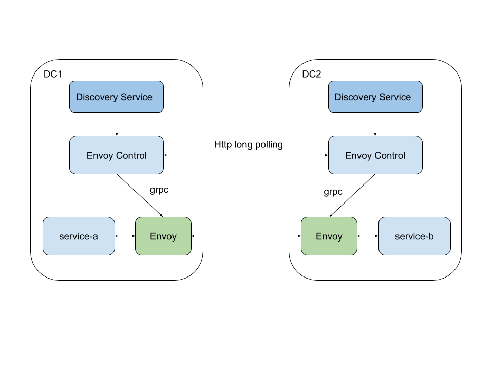

# Multi-DC Support

Envoy Control is ready to be used in an environment with multiple data centers (or clusters as a more generic term).
When running services in multiple clusters, you probably want to leverage the fact
that when an instance in one cluster is down, there is a fallback to an instance in another.

## Strategies
There are two strategies when running Envoy across many clusters.

### Edge Envoys
The first strategy is to run a fleet of front proxies (Envoys) at each cluster.
When no instance of a service is available in the local one,
the extra routes for each remote cluster are registered and requests are forwarded to one of them.
This simplifies Control Plane's logic, but the fleet has to be maintained with HA in mind because it's a single point
of failure.
Additionally, there is a cost of one extra request/response redirect.
The extra challenge here is to not end up in an infinite loop.

### Instance synchronization
The second strategy is to have all instances from all clusters available in Envoy but with different
[priorities](https://www.envoyproxy.io/docs/envoy/latest/intro/arch_overview/load_balancing/priority).
Only if there are no instances in the local cluster, an instance from remote cluster will be used.
The main benefit of this approach is a lack of single point of failure and maintainability at the cost of extra logic
in Control Plane.

Envoy Control supports the second strategy.

It periodically polls the state of discovery service from Envoy Controls from every other cluster.
Then it merges the responses with proper priorities.

## Configuration

### With Envoy Control Runner

If you use Consul and Envoy Control Runner, it's as easy as changing the property `envoy-control.sync.enabled` to true,
assuming that you register Envoy Control under the `envoy-control` name in Consul.

You can see a list of settings [here](../configuration.md#cross-dc-synchronization)

### Without Envoy Control Runner

If you don't use Envoy Control Runner, you have to fulfil the contract.
Create an endpoint `GET /state` with your framework of choice that will expose current local state of Envoy Control.
The state is available in `LocalClusterStateChanges#latestServiceState`.

Then build a `RemoteServices` class providing:

* [AsyncControlPlaneClient](https://github.com/allegro/envoy-control/blob/master/envoy-control-runner/src/main/kotlin/pl/allegro/tech/servicemesh/envoycontrol/synchronization/AsyncRestTemplateControlPlaneClient.kt) - an HTTP client
* [ControlPlaneInstanceFetcher](https://github.com/allegro/envoy-control/blob/master/envoy-control-source-consul/src/main/kotlin/pl/allegro/tech/servicemesh/envoycontrol/consul/synchronization/SimpleConsulInstanceFetcher.kt) - the strategy of retrieving other Envoy Control from given cluster
* `remoteClusters` - list of remote clusters

Refer to [Envoy Control Runner](https://github.com/allegro/envoy-control/tree/master/envoy-control-runner) module for a sample implementation.
